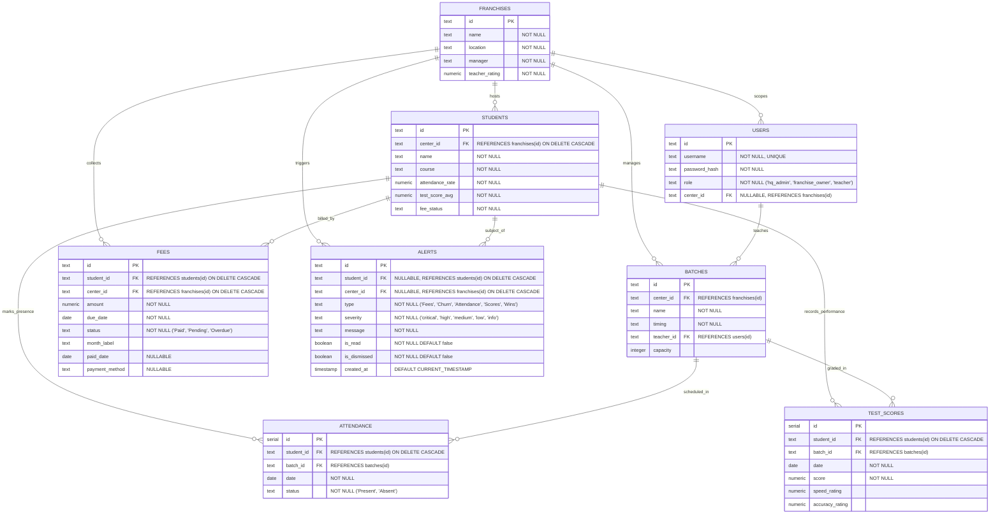

# AFISR Database Entity-Relationship (ER) Diagram

This document contains the Entity-Relationship diagram and detailed schema descriptions for the **Franchise Intelligence System (AFISR)**. The database is hosted on **TimescaleDB Cloud** (PostgreSQL-compatible) and supports operational task tracking, fee records, student telemetry, and multi-tenant scoping (HQ vs. Franchise Center vs. Teacher).

---

## 📊 Entity-Relationship Diagram

The diagram below represents the tables, key attributes, and relationship cardinalities within the AFISR system:

---

## 📋 Schema Specifications

### 1. `franchises`
Represents the centers/franchises belonging to Metro Brain EduCare.
*   `id` (`text`): Primary key (e.g., `f1`, `f2`).
*   `name` (`text`): Name of the center.
*   `location` (`text`): Geographical city/area.
*   `manager` (`text`): Name of the franchise manager.
*   `teacher_rating` (`numeric`): Average rating of teachers in that center.

### 2. `students`
Represents individual students enrolled at centers.
*   `id` (`text`): Primary key (e.g., `s1`, `s2`).
*   `center_id` (`text`): Foreign key referencing `franchises.id`.
*   `name` (`text`): Full name of the student.
*   `course` (`text`): Target program (e.g., `Abacus Level 1`, `Vedic Math`).
*   `attendance_rate` (`numeric`): Rolling attendance percentage.
*   `test_score_avg` (`numeric`): Rolling academic test score average.
*   `fee_status` (`text`): General payment status indicator (`Paid`, `Pending`, `Overdue`).

### 3. `users`
System accounts for authentication and access control scoping.
*   `id` (`text`): Primary key.
*   `username` (`text`): Unique handle.
*   `password_hash` (`text`): Securely hashed password.
*   `role` (`text`): Role name (`hq_admin` has broad access; `franchise_owner` and `teacher` are limited by `center_id`).
*   `center_id` (`text`): Nullable foreign key referencing `franchises.id`. Scopes user access.

### 4. `batches`
Cohorts/classes schedule setups.
*   `id` (`text`): Primary key.
*   `center_id` (`text`): Foreign key referencing `franchises.id`.
*   `name` (`text`): Batch label (e.g., `Batch A`, `Evening Advanced`).
*   `timing` (`text`): Class timings.
*   `teacher_id` (`text`): Foreign key referencing `users.id` (users with role `teacher`).
*   `capacity` (`integer`): Max seat count.

### 5. `fees`
Ledger of monthly invoices and collections.
*   `id` (`text`): Primary key.
*   `student_id` (`text`): Foreign key referencing `students.id`.
*   `center_id` (`text`): Foreign key referencing `franchises.id`.
*   `amount` (`numeric`): Fee due amount.
*   `due_date` (`date`): Deadline date.
*   `status` (`text`): Standing (`Paid`, `Pending`, `Overdue`).
*   `month_label` (`text`): Targeted period string (e.g. `Jan 2026`).
*   `paid_date` (`date`): Date of collection.
*   `payment_method` (`text`): Collection mode (e.g., `Cash`, `UPI`, `Card`).

### 6. `attendance`
Session attendance ledger.
*   `id` (`serial`): Auto-incrementing primary key.
*   `student_id` (`text`): Foreign key referencing `students.id`.
*   `batch_id` (`text`): Foreign key referencing `batches.id`.
*   `date` (`date`): Date of the session.
*   `status` (`text`): Marked presence (`Present`, `Absent`).

### 7. `test_scores`
Individual test result tracking.
*   `id` (`serial`): Auto-incrementing primary key.
*   `student_id` (`text`): Foreign key referencing `students.id`.
*   `batch_id` (`text`): Foreign key referencing `batches.id`.
*   `date` (`date`): Examination date.
*   `score` (`numeric`): Earned marks.
*   `speed_rating` (`numeric`): Telemetry tracking speed.
*   `accuracy_rating` (`numeric`): Telemetry tracking accuracy.

### 8. `alerts`
Notification objects powering the *Today's Focus* inbox.
*   `id` (`text`): Primary key.
*   `student_id` (`text`): Nullable foreign key referencing `students.id`.
*   `center_id` (`text`): Nullable foreign key referencing `franchises.id`.
*   `type` (`text`): Event group (`Fees`, `Churn`, `Attendance`, `Scores`, `Wins`).
*   `severity` (`text`): Attention weight (`critical`, `high`, `medium`, `low`, `info`).
*   `message` (`text`): Alert details text.
*   `is_read` (`boolean`): Badge status flag.
*   `is_dismissed` (`boolean`): Active inbox visibility filter.
*   `created_at` (`timestamp`): Generation timestamp.
